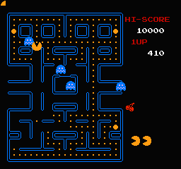
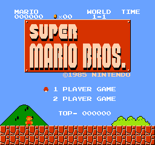
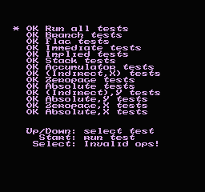

# NES Emulator in Rust

This is a NES emulator written in Rust, following Rafael Bagmanov's e-book, [Writing NES Emulator in Rust](https://bugzmanov.github.io/nes_ebook).

The emulator exists as a learning project, and will deviate from the e-book to explore Rust ideoms, where I see fit.

## Installation

1. Install Rust and Cargo by following the instructions [here](https://www.rust-lang.org/tools/install).
2. Clone this repository: `git clone https://github.com/acr92/nes_emulator_rs.git`
3. Navigate to the project directory: `cd nes_emulator_rs`
4. Build the project: `cargo build`

## Usage

1. Ensure that you have a NES game ROM file. These can be obtained from various sources online.
2. Run the emulator: `cargo run -- path/to/rom/file.nes`

## Resources used

- [Writing NES Emulator in Rust](https://bugzmanov.github.io/nes_ebook)
- [Easy 6502](https://skilldrick.github.io/easy6502/)
- [NesDev](https://www.nesdev.org)
- [6052-NMOS Extra Opcodes](http://www.ffd2.com/fridge/docs/6502-NMOS.extra.opcodes)
- [One lonely coder - NES Emulator from Scratch on YouTube](https://www.youtube.com/playlist?list=PLrOv9FMX8xJHqMvSGB_9G9nZZ_4IgteYf)

## Contributing

Pull requests are welcome. For major changes, please open an issue first to discuss what you would like to change.

Please make sure to update tests as appropriate.

## License

This project is licensed under the [MIT License](https://opensource.org/licenses/MIT).
